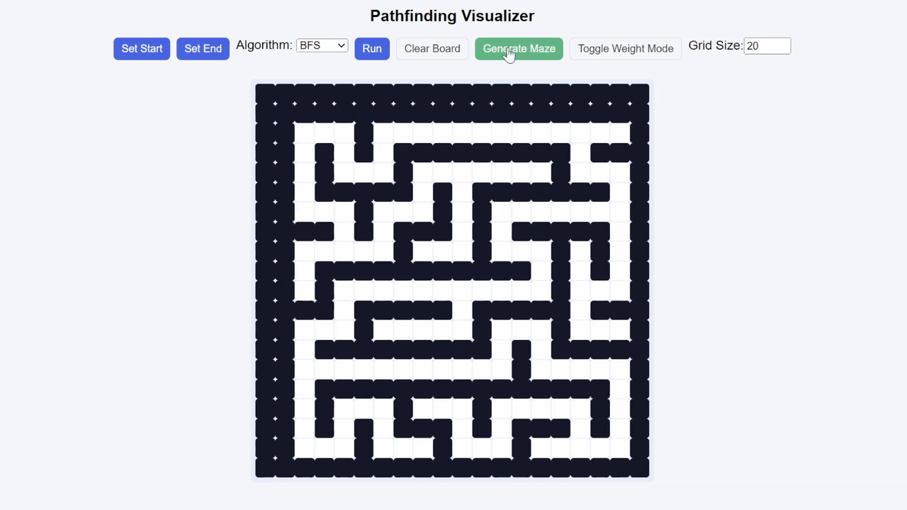

# Pathfinding Visualizer

Interactive pathfinding visualizer for BFS, DFS, Dijkstra, and A* algorithms.

## Features
- Set Start and End points
- Draw walls and weighted cells
- Adjustable grid size
- Visualize algorithm progress in real-time
- Generate random mazes

## Tech Stack
- HTML / CSS / JavaScript
- Fully browser-based, no extra libraries

## How to Use
1. Open `index.html` in your browser
2. Click "Set Start" and "Set End"  
3. Draw walls by clicking / dragging  
4. Toggle "Weight Mode" to add weighted cells  
5. Choose an algorithm and click "Run"  
6. Watch the algorithm explore the grid and find the shortest path

## Learning Outcomes
- Understand BFS, DFS, Dijkstra, A*  
- Visualize search processes  
- Practice front-end DOM manipulation and JS logic